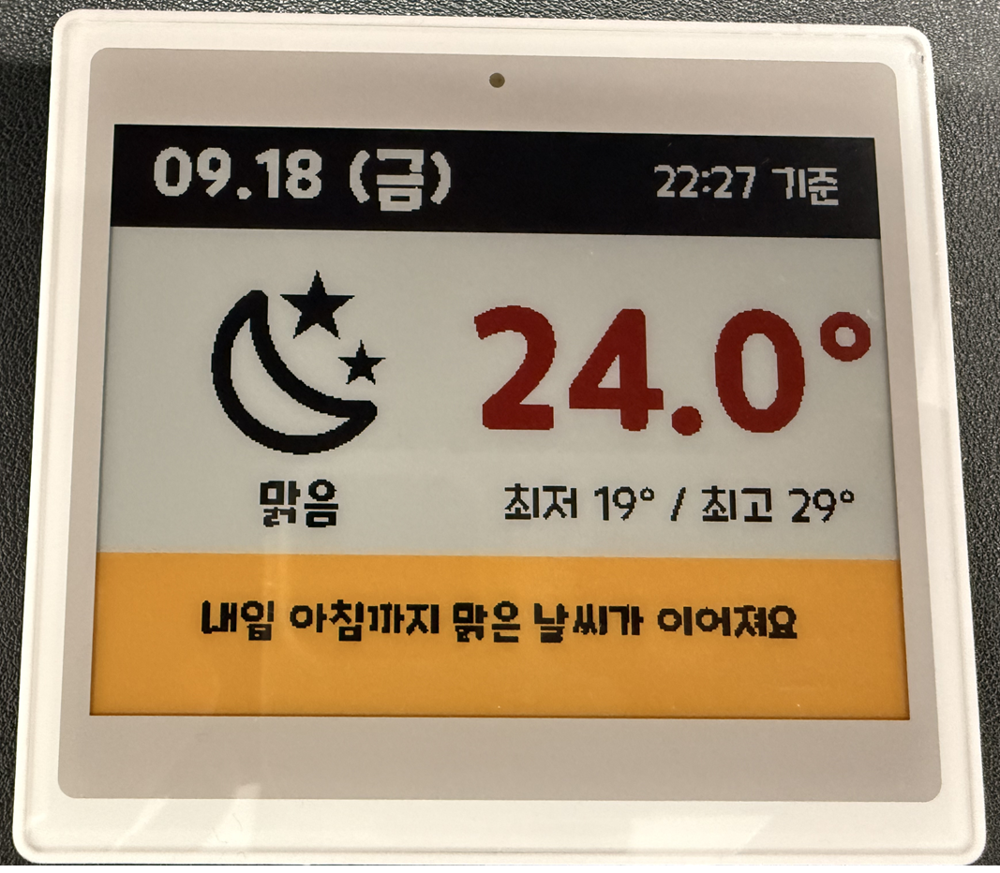

# Poshiji PSJ-420 (XTE)

BLE ESL supports the Poshiji PSJ-420, a 400x300 black/white/red/yellow label,
using its XTE protocol. Manufacturer, model and colors were confirmed by the
device owner, who verified working screen updates with this backend on the
real tag. The preset uses `reported` confidence. The protocol codec and BLE
transaction are also covered by automated tests.

## Product photo

Original photograph supplied by the device owner. It shows black text and icons,
white background, red temperature and a yellow footer. The displayed date,
weather and temperature are the photographed screen contents, not live data.

## Purchase

[AliExpress — Poshiji PSJ-420 purchase listing](https://ko.aliexpress.com/item/1005012582138232.html)

This link was supplied by the device owner. The listing contents could not be
retrieved during documentation preparation. Select/check **PSJ-420, 4.2-inch,
400×300, BWRY, BLE** with the seller; do not assume every listing option uses
this protocol. Current price, availability, accessories and seller warranty
are not recorded here.

## Product specifications and evidence

| Item | Value | Basis |
|------|-------|-------|
| Brand | Poshiji | Owner identification |
| Model | PSJ-420 | Owner identification |
| Nominal panel class | 4.2-inch | Model/profile identification; not a physical measurement |
| Resolution | 400 × 300 pixels | Owner specification and decoded image header |
| Aspect ratio | 4:3 landscape | Resolution and photograph |
| Display | Four-color electronic shelf label / e-paper | Owner description and photograph |
| Colors | Black, white, red, yellow (BWRY) | Owner confirmation and visible photo contents |
| Connection | Bluetooth Low Energy, connected GATT | Radio capture |
| Integration backend | `poshiji` / Poshiji (XTE) | BLE ESL implementation |
| Preset key | `psj-420` | BLE ESL implementation |
| Image packing | 2 bits/pixel, 30,000 bytes before RLE | Capture reconstruction |
| Compression | Run-length encoding (count, byte) | Byte-for-byte capture verification |
| Discovery | Manufacturer ID `0x5258` plus known advertisement prefix | Capture and follow-up observation |
| Battery / temperature telemetry | Not decoded or exposed | No validated field interpretation |
| Hardware confidence | Owner-verified working updates | Device owner tested this backend; codec/transport covered by tests |

**Not established:** enclosure dimensions/weight, battery type/capacity/life,
operating temperature, IP rating, exact Bluetooth specification version,
maximum range and rated panel refresh time. LE 1M in the capture is a PHY,
not evidence of a particular Bluetooth version. The roughly 0.69-second image
transfer in one capture is not the panel's physical refresh time or a guarantee.

## Examples

All layouts are native 400×300; Home Assistant selects the size from the preset.
Use `black`, `white`, `red` and `yellow`; other colors are quantized to BWRY.

- [Four-color check](../examples/poshiji/psj420-color-test.yaml): a complete `ble_esl.write` action drawing four labeled swatches; replace `device_id` and add `dry_run: true` under `data` to preview only.
- [Naver weather automation](../examples/poshiji/psj420-weather-demo.yaml): weekday 08:00 / 11:00 / 14:00 / 17:00 updates, daily forecast low/high, fine-dust warnings and a two-line weather comment. Uses the owner-supplied actual device photo.
- [Example setup instructions](../examples/poshiji/README.md): placeholders, preview/send behavior and entity requirements.

## Installation and use

Install BLE ESL (HACS or copy `custom_components/ble_esl` to
`/config/custom_components/`), then restart Home Assistant. Add the tag through
Settings > Devices & Services > BLE ESL. Manufacturer is Poshiji; the PSJ-420
model is detected automatically. Protocol and model are saved and restored by
the standard BLE ESL config flow.

Write with `ble_esl.write` / `ble_esl.write_guarded` and select the BLE ESL
device. Use `dry_run: true` for a preview before writing. Make sure no other
integration writes to the same tag.

After enabling notifications the writer waits 0.5 s before the prepare
command, like the other backends. Writes use the smaller of 244 bytes and
the backend's reported write limit.
20-byte limits are accepted without changing logical XTE block contents.
Retry Count and Write Delay options apply to the Poshiji backend; the delay is
applied once per XTE command or block, not per ATT chunk.

## Discovery limits

Only manufacturer ID `0x5258` with a 13-byte payload beginning with
`fd024002009964060102ffff` is recognized. The final byte is ignored: the owner
observed it change from `1e` to `1b` after a successful screen update. Its
meaning is not confirmed, so no battery/voltage readings are invented.

No MAC address or device name is hardcoded. The discovery filter intentionally
does not treat every device with this manufacturer ID as a PSJ-420. Changes
to the other 12 bytes still require investigation before widening the matcher.

## Protocol

- Service: `00002760-08c2-11e1-9073-0e8ac72e1001`
- Write without response: `00002760-08c2-11e1-9073-0e8ac72e0001`
- Notifications: `00002760-08c2-11e1-9073-0e8ac72e0002`
- Pixels: row-major, four pixels per byte, high bits first; 00 black, 01 white,
  10 yellow, 11 red. This mapping is consistent with the owner-supplied four-color photograph.
- RLE: `(count, byte)` pairs, runs up to 255, with a reset halfway through the
  30000-byte packed frame (observed at offset 15000).
- XTEK object: magic [0:4], sum of bytes [12:] as big-endian uint32 [4:8],
  total length [8:12], observed opaque metadata [12:25], width [25:29], height
  [29:33], observed flag 01 [33], RLE length [34:38], RLE body [38:].
- Logical block: `XTE 02`, big-endian uint16 total length, one-byte sum of all
  following bytes, total block count, zero-based block index, up to 1211 bytes
  of object data. Each logical block is split into <=244-byte BLE writes.
- Preparation: `XTE 01`, one-byte total length, one-byte payload sum,
  `01` followed by big-endian uint32 object length.
- Finish: `58 54 45 01 08 04 04 00`.
- Replies: XTE 04 frames; the declared length excludes trailing padding.
  Checksum and payload are checked. Only captured positive payloads `01 ff bd`
  (prepare) and `04 ff` (finish) are accepted. Unknown statuses fail explicitly.

The opaque metadata and reply values are preserved from a single successful
capture; they are not a general specification for all XTE devices. A finish
acknowledgment means the transaction was acknowledged, not that the e-paper
has completed its physical refresh. No pairing or encryption was observed.

## Validation

The original 10244-byte XTEK object was regenerated byte-for-byte from its
decoded pixels, including its checksum; all nine logical blocks also match
the capture after replacing two bad-CRC packets with their valid retransmits.
Object SHA-256:
`b8edd478d1a8482dd9bd4baa066eeedcfc609c308b36a002b409dc9af600ed1d`.

Automated tests cover RLE boundaries, pixel ordering, header checksums, block
sizes, observed commands, the BLE transaction using a fake client, invalid
replies, timeout, write failure and 20/182/244/514-byte backend write limits.
No raw radio capture or
nearby-device addresses are included in this repository.

## Troubleshooting

| Symptom | Check |
|---------|-------|
| Device not discovered | Bluetooth is enabled, device is in range, advertisement matches the documented prefix. Do not match on a fixed MAC/name. |
| Metadata unavailable after an update | The advertisement's final byte is variable and is ignored by the matcher; if the tag stops being recognized, capture the new manufacturer data and open an issue. |
| Response timeout or repeated failures | Verify that only one integration writes to the tag, check adapter/proxy reachability, and retain the underlying Poshiji error log. Smaller write limits are supported; do not force 244-byte writes. |
| Preview updates but panel does not | The preview is not a readback. Check `dry_run` under `data`; neither example sets it, so both send to the panel. |
| Weather automation does nothing | Check the target device ID, Naver weather/sensor entity IDs and daily forecast availability. Scheduled runs are on weekdays at 08:00, 11:00, 14:00 and 17:00. |

The Naver example calls `weather.get_forecasts` with `type: daily` and uses the
first returned forecast for low/high values. It expects a non-empty forecast
and valid weather/sensor data; it does not include an unavailable-data guard.
Avoid overly frequent redraws; this is an e-paper panel, not an LCD.
