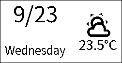
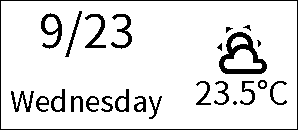
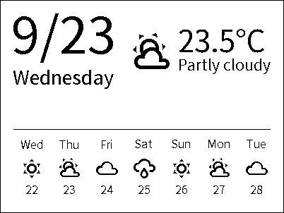
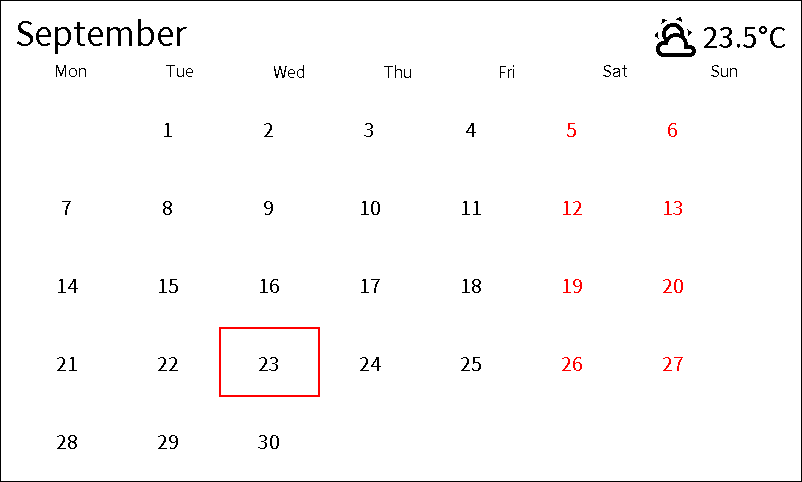
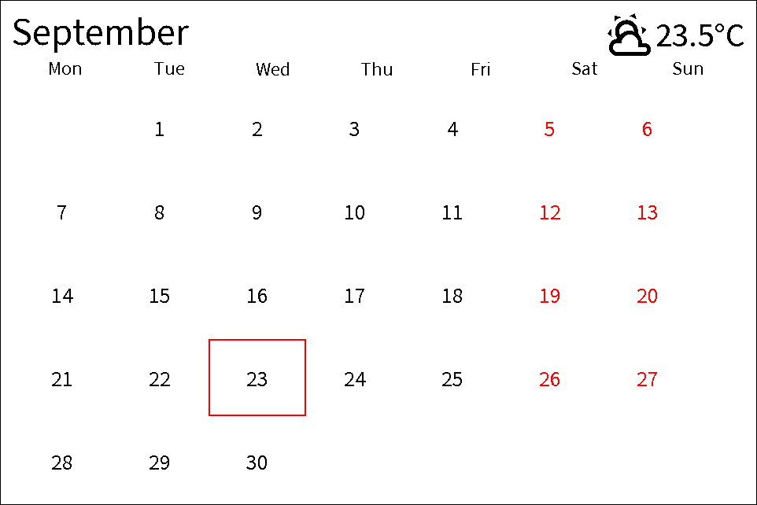

# Layout blueprints

These are Home Assistant automation blueprints. They are separate from the
pixel-placed examples in [`gicisky/`](../gicisky) and [`poshiji/`](../poshiji).

`board.yaml` is one layout that changes what it shows with the tag height,
read from the model (`296x128`, `400x300`, …):

- Height under 200 (2.1", 2.9"): today's date and today's weather, stacked
  like the 2.1" date label and placed beside the weather icon.
- Height 200–449 (4.2"): today's reading plus the coming week. The first
  forecast cell is today.
- Height 450 and up (7.5", 10.2"): the month grid, with today's weather
  beside the month name. Today has a red box. Weekend dates are red.

Rendered samples for 2026-09-23:

| 250×128 | 296×128 | 400×300 |
|---------|---------|---------|
|  |  |  |

| 800×480 | 960×640 |
|---------|---------|
|  |  |

**Text scale** only multiplies those sizes. The date and weekday lines are
templates you can replace. Forecast labels and the calendar header use
`%a` and `%B`, so they follow the host clock locale and are often English.
Weather condition text is Home Assistant's translated state. Redraw uses a **time pattern** (`0` matches that value,
`/1` matches every hour) with seconds kept at `0`. **Font** is a file name
resolved by the component from its fonts folder or `config/www/fonts`.

The blueprint does not set `rotate`, so the layout assumes the panel's
native orientation.

Copy this folder to `config/blueprints/automation/ble_esl/`, then
**Settings → Automations & scenes → Create automation → Blueprint**.
Requires Home Assistant 2025.12 or newer, the same floor as the integration.
