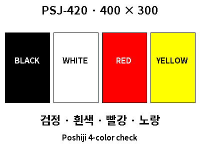

# Poshiji PSJ-420 예제 (400×300 BWRY)

[제품·구매·프로토콜 안내](../../docs/poshiji-psj420.md)

## 1. 4색 확인

[psj420-color-test.yaml](psj420-color-test.yaml)

이 파일은 사용자가 제공한 **payload 목록**입니다. 전체 서비스 호출이나 자동화가 아니므로 `ble_esl.write` 작업의 `data.payload` 아래에 넣으세요. 대상 장치는 별도로 선택합니다. 미리보기는 `data.dry_run: true`, 실제 전송은 `false`로 지정하며 배경은 `white`를 사용하세요. 표시 내용은 동일하므로 기존 렌더링 미리보기를 유지했습니다.

## 2. 네이버 날씨 자동화

[psj420-weather-demo.yaml](psj420-weather-demo.yaml)

위 사진은 사용자가 제공한 **실제 제품 화면**입니다. 렌더링한 예시 이미지가 아니며, 촬영 당시의 날짜와 날씨가 표시돼 있습니다. 기존 파일 링크를 유지하기 위해 파일명은 `psj420-weather-demo.yaml`로 유지했습니다.

설정 → 자동화의 YAML 편집기에 붙여넣습니다. 사용자 제공 자동화를 기준으로 작성했으며, 평일(월~금) **08:00 / 11:00 / 14:00 / 17:00**에 실제 화면을 갱신합니다. 요일 제한은 시간 조건으로 지정했습니다.

### 필요한 엔터티와 설정

| 설정 / 엔터티 | 기본값 및 용도 |
|---|---|
| `location` | `gurodong` — 설치한 네이버 날씨 지역 접미사로 변경 |
| `wn_weather` | `weather.wn_{{ location }}` — 현재 기온·상태와 일간 예보 |
| `wn_cond` | `sensor.wn_{{ location }}_current_condition` — 날씨 설명 |
| `wn_pm10` | `sensor.wn_{{ location }}_pm10_description` — 미세먼지 등급 |
| `wn_comment` | `sensor.wn_{{ location }}_day_short_comment` — 날씨 안내 문구 |
| `target.device_id` | 사용자 제공 ID를 보존함. 다른 설치에서는 본인의 BLE ESL 장치 ID로 변경 |
| 폰트 | 저장소에 포함된 `CookieRunBold.ttf`, `CookieRunRegular.ttf` |

`weather.get_forecasts`의 `daily` 응답에서 첫 번째 예보를 사용해 최저·최고 기온을 표시합니다. 실제 엔터티 이름이 표와 다르면 변수 네 개를 직접 수정하세요. 네이버 날씨 엔터티와 센서는 별도로 구성돼 있어야 합니다.

### 화면 구성

- 검정 헤더: 날짜·요일, 갱신 시각.
- 중앙: 날씨 아이콘·설명, 빨간 현재 기온, 최저·최고 기온.
- 노란 하단: 날씨 안내 문구를 두 줄로 분리.
- 비·눈 또는 미세먼지 `나쁨` / `매우나쁨`이면 첫 줄을 빨간 경고로 표시.

이 자동화는 `ble_esl.write`를 사용하고 미리보기 전용 옵션이 없으므로 실행하면 실제 전송합니다. 같은 장치를 대상으로 하는 이전 Gicisky 자동화는 비활성화하세요.

### 검증 범위와 전제

YAML 구조와 정상 날씨·비/눈·미세먼지 경고 템플릿을 샘플 데이터로 검증했습니다. 실제 HA 실행은 사용자 환경에서 확인해야 합니다. 원본 로직대로 유효한 현재 기온과 비어 있지 않은 일간 예보를 전제로 하며, 예보 누락·센서 unavailable 상태에 대한 별도 처리나 조건은 포함하지 않았습니다.
