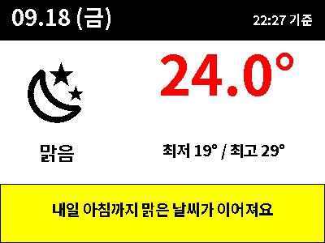
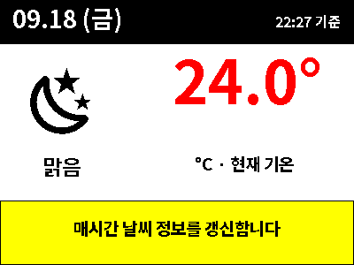

# Poshiji PSJ-420 예제 (400×300 BWRY)

[제품·구매·프로토콜 안내](../../docs/poshiji-psj420.md) ·
[실물 사진](../../docs/images/poshiji/poshiji_psj420_4color.png)

## 시작하기

1. BLE ESL 통합에서 Poshiji PSJ-420을 추가합니다.
2. YAML의 `REPLACE_WITH_YOUR_BLE_ESL_DEVICE_ID`를 **HA 장치 ID**로 바꿉니다. MAC 주소나 엔터티 ID가 아닙니다. 개발자 도구 → 작업에서 대상 장치를 고른 뒤 YAML에 표시되는 ID를 사용할 수 있습니다.
3. 정적 예제는 개발자 도구 → 작업의 YAML 모드에 붙여넣습니다. `dry_run: true`로 실행하면 Preview Content만 갱신됩니다.
4. 미리보기를 확인한 뒤 `dry_run: false`로 바꾸면 실제 패널로 보냅니다.
5. 기존 Gicisky 통합에서 같은 장치로 보내는 자동화는 비활성화합니다. 서비스는 `ble_esl.write` 또는 `ble_esl.write_guarded`입니다.

별도 폰트 설치 없이 저장소의 `NotoSansKR-Bold.ttf`와 날씨 아이콘을 사용합니다. 미리보기의 선명한 RGB 색과 실제 전자종이 색감은 다를 수 있습니다.

## 1. 4색 확인

[psj420-color-test.yaml](psj420-color-test.yaml)

검정·흰색·빨강·노랑 사각형과 한글 표시를 확인합니다. 먼저 이 예제로 색상과 방향을 확인하세요. 기본값은 미리보기 전용입니다.

## 2. 실물 사진을 참고한 날씨 화면

[psj420-weather-demo.yaml](psj420-weather-demo.yaml)

`09.18 (금)`, `22:27`, `24.0°`, 최저 19° / 최고 29°는 **고정 샘플 값**입니다. 검정 헤더, 빨간 기온, 노란 안내 영역으로 사진과 비슷하게 구성했습니다. 원본 화면을 추출한 파일이나 현재 날씨가 아닙니다.

## 3. 현재 날씨 자동화

[psj420-weather-automation.yaml](psj420-weather-automation.yaml)

설정 → 자동화의 YAML 편집기에 넣고 다음 두 항목을 수정합니다.

| 항목 | 바꿀 값 |
|---|---|
| `target.device_id` | 추가한 BLE ESL 장치의 ID |
| `variables.weather_entity` | 실제 날씨 엔터티 (예: `weather.home`) |

- 매시 정각에 `ble_esl.write_guarded`로 **실제 전송**합니다 (`dry_run: false`).
- 날짜·요일·시간은 HA의 로컬 시간을 사용합니다.
- 날씨 상태와 `temperature`, `temperature_unit` 속성을 읽습니다. 별도 API 키나 추가 센서는 요구하지 않습니다.
- 날씨 엔터티가 `unknown` / `unavailable`이면 예약 실행을 건너뜁니다.
- 기온이 없으면 `--°`, 매핑되지 않은 상태는 `확인 필요`로 표시합니다.
- 최저·최고 기온은 현재 기온 속성으로 알 수 없어 포함하지 않았습니다. 예보가 필요하면 별도의 예보 조회를 추가하세요.
- 미리보기 PNG는 2026-09-18 22:27, 맑음, 24°C를 가정해 렌더링한 것입니다.

자동화의 작업 실행 버튼으로 즉시 시험할 수 있습니다. 이 버튼은 조건을 건너뛸 수 있으므로 날씨 엔터티가 유효한지 먼저 확인하세요. 변경 없는 화면 전송을 줄이려면 통합의 Prevent Duplicate Send 옵션을 사용하세요. 화면에 시간이 포함되므로 시간이 달라진 화면은 중복으로 취급되지 않습니다.

## 검증 범위

YAML 파싱, 샘플 Jinja 템플릿 평가, 400×300 이미지 렌더링을 확인했습니다. 맑음·비·눈, 0도·영하·기온 미제공 값도 템플릿 수준에서 확인했습니다. 실제 HA 자동화 실행과 각 날씨 제공자의 속성은 사용자 환경에서 확인해야 합니다.
